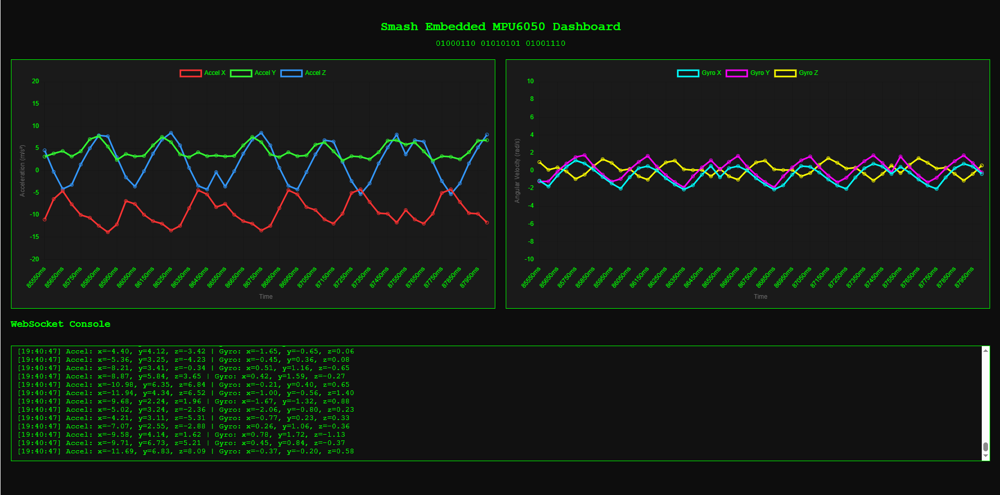
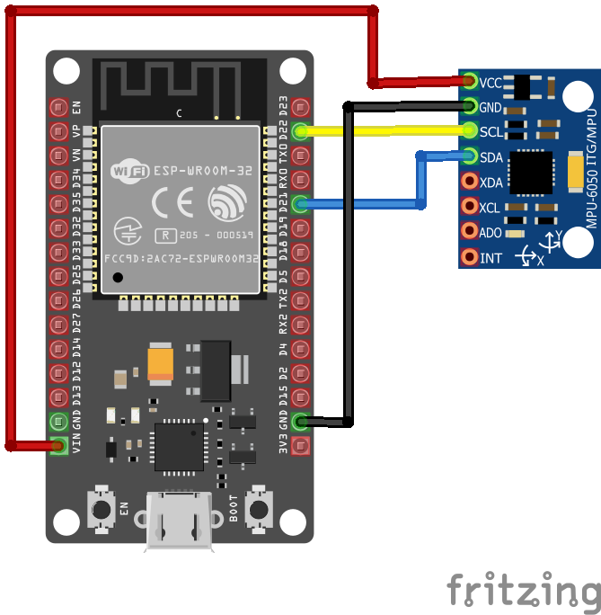

# MPU6050 IMU


A real-time ESP32 IMU dashboard using **MPU6050**, **WebSockets**, and **Chart.js**, built as a [PlatformIO](https://platformio.org/) project. It uses **FreeRTOS** under the hood to run sensor data acquisition on a dedicated core task.

---

## Preview



A real-time graph showing accelerometer and gyroscope data in action.

---

## ✨ Features

## Features

- FreeRTOS filtered MPU6050 data streaming.
- Low-pass filter for smoothing noisy sensor data.
- Dual-line chart visualization: Accel & Gyro.
- Fast WebSocket communication using `ESPAsyncWebServer`.
- Responsive Chart.js interface.
- Structured as a PlatformIO project.

---

## Hardware Required

- ESP32
- MPU6050
- Micro USB cable
- WiFi network

---

## Wiring Diagram



---

## Setup

### 1. Clone the repo

```bash
git clone https://github.com/smashembedded/mpu6050-dashboard.git
cd mpu6050
```

### 2. Configure WiFi Credentials

Create a file at `include/wifi_credentials.h`

```bash
#pragma once
#define WIFI_SSID     "YourSSID"
#define WIFI_PASSWORD "YourPassword"
```

### 3. Upload the  Web Interface to SPIFFS

Make sure your dashboard HTML is placed in `data/index.html`

```bash
pio run --target uploadfs
```

### 4. Flash the Firmware

```bash
pio run --target upload
```

### 5. Open Serial Monitor (optional)

```bash
pio device monitor
```

### 6. Access the Dashboard

After connecting to WiFi, open a browser to:

```bash
http://<ESP32_IP>/
```

Check the serial output for your device's IP address.

---

## How It Works

- ESP32 reads and filters MPU6050 data at ~40Hz.
- Accumulated in batches of 10 and sent via WebSocket.
- Browser receives data as a JSON array and updates two real-time charts.

---

## Dependencies

Check `platormio.ini`:

- ArduinoJson
- ESP Async WebServer
- AsyncTCP
- Adafruit MPU6050
- Adafruit Unified Sensor

---

## PlatformIO

Install the [PlatformIO IDE](https://platformio.org/install) (VS Code extension recommended)

---

## 🤝 Contributing

Contributions, bug reports and feature suggestions are welcome!  
Feel free to open an issue or submit a pull request.

---

## Support

GitHub Sponsors coming soon!  
⭐ this repo or [follow me](https://github.com/tu-usuario) to stay updated.

---

## Contact

[Reach out on [Twitter](https://twitter.com/tu_handle) or via [email](mailto:you@example.com).].

---

## License

[Apache License 2.0](LICENSE) © Smash Embedded
See the [Apache License](https://www.apache.org/licenses/LICENSE-2.0) for full terms.

---

## Credits

* [Chart.js](https://www.chartjs.org/) for interactive charting.
* [ESPAsyncWebServer](https://github.com/me-no-dev/ESPAsyncWebServer).
* [Adafruit MPU6050 Library](https://github.com/adafruit/Adafruit_MPU6050).
* [Vanepp](https://forum.fritzing.org/u/vanepp/summary) for providing the ESP32 Fritzing model on the [forum](https://forum.fritzing.org/t/esp-32-de-30-pines/22637).
